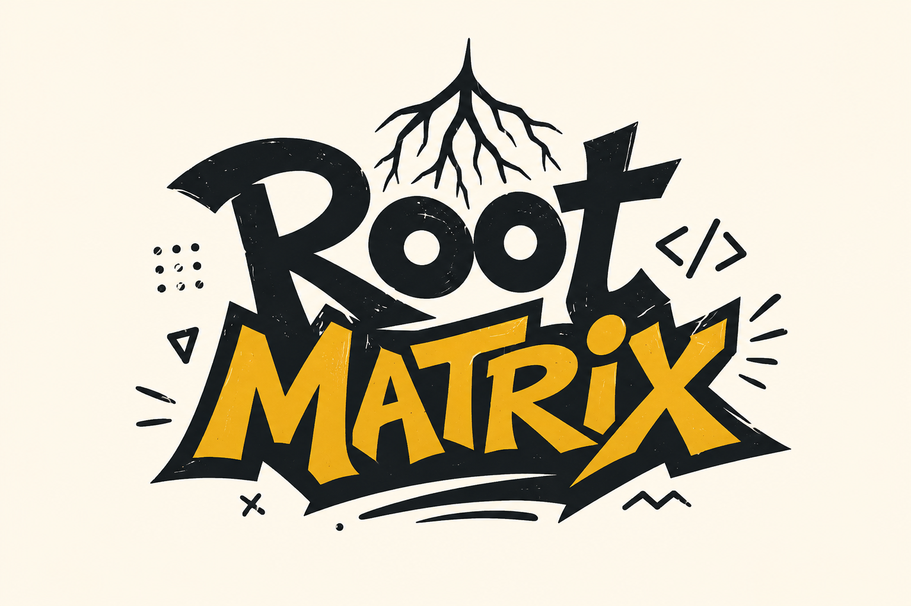
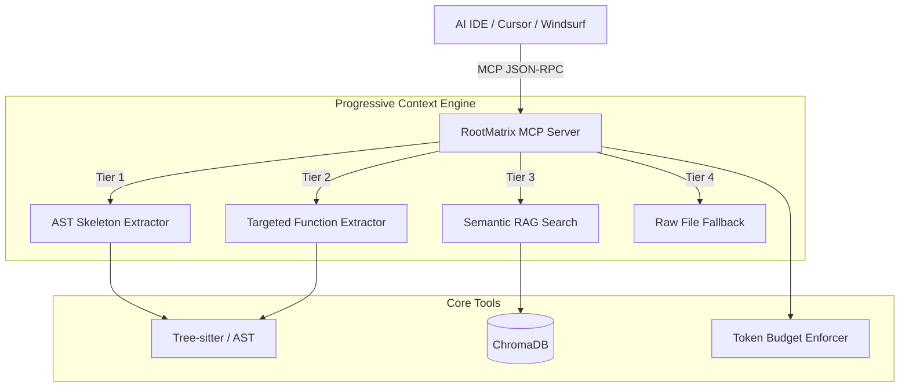

<div align="center">


# 🧠 RootMatrix
**Universal Token Optimization & Context Control for AI IDEs**
Force AI agents to navigate your codebase surgically, slash token overhead, and eliminate hallucinations.

[](https://www.python.org/downloads/release/python-3100/)
[](https://github.com/jlowin/fastmcp)
[](https://tree-sitter.github.io/)
[](https://opensource.org/licenses/MIT)

[The Problem](#-the-problem) •
[Architecture](#-system-architecture) •
[Tech Stack](#️-tech-stack) •
[Exposed Tools](#️-mcp-tools-exposed-to-agents) •
[Installation & CLI](#-installation--cli-guide) •
[IDE Integration](#-ide-integration)

</div>

---

## 🤔 The Problem

Traditional AI coding agents pull entire source files into the context window just to inspect a single function signature. This behavior causes:

* 💸 **Token Waste:** Depletes massive portions of the available context window.
* 📈 **Inflated Costs:** Runs up unnecessary API credit usage.
* 😵‍💫 **Context Noise:** Floods the LLM with irrelevant boilerplate, leading to confusion and hallucinations.
* 🐢 **Latency:** Drastically slows down generation times due to oversized prompt payloads.

---

## 🏗️ System Architecture

RootMatrix intercepts file read requests and enforces a progressive, four-tiered retrieval strategy to keep prompt payloads minimal and highly relevant.



| Tier | Strategy | Core Mechanism |
| --- | --- | --- |
| **Tier 1** | **Skeleton Extraction** | Extracts only class definitions, signatures, and docstrings via `tree-sitter`. |
| **Tier 2** | **Targeted Retrieval** | Isolates and extracts only the specific function body the AI needs to edit. |
| **Tier 3** | **Semantic Snippets** | Executes a local RAG search across the workspace to find exact symbol occurrences. |
| **Tier 4** | **Raw Fallback** | Allows full file reads only if strictly necessary and within the daily token budget. |

---

## ⚙️ Tech Stack

* **Runtime:** Python 3.10+
* **Protocol Framework:** [FastMCP](https://github.com/jlowin/fastmcp) for robust Model Context Protocol server orchestration.
* **AST Parsing:** `tree-sitter` (for JavaScript/TypeScript structural parsing) & native Python `ast`.
* **Tokenization:** `tiktoken` for precise LLM context budget tracking.
* **Vector Database:** `chromadb` for localized semantic code search.
* **CLI Interface:** `click` for seamless IDE configuration injection.

---

## 🛠️ MCP Tools Exposed to Agents

When connected, AI agents automatically gain access to these surgical tools:

* **`get_project_map(dir_path)`**: Generates a structural tree representation of the workspace (ignoring noisy folders like `node_modules` or `venv`).
* **`read_optimized_file(file_path)`**: The default file inspection tool. Strips out inner implementation logic, leaving only imports, classes, signatures, and docstrings. *(Slashes a typical 4k-token file down to ~400 tokens).*
* **`read_function(file_path, function_name)`**: Surgically extracts and returns only the code body of the specified function.
* **`find_references(dir_path, symbol_name)`**: Locates global occurrences of a specific function or class across the workspace.
* **`search_codebase(file_path, query)`**: Local semantic search powered by ChromaDB.
* **`get_context_budget(file_path)`**: Monitors token usage and enforces a daily limit.
* **`read_raw_file(file_path)`**: The ultimate fallback tool. Returns unoptimized, raw file contents. Agents are instructed to use this exclusively during major, file-wide refactoring tasks.

---

## 🤖 System Prompting & Usage Instructions

To ensure your AI agent uses RootMatrix tools effectively, add the following prompt rules to your project's `.cursorrules`, `.windsurfrules`, or system prompt:

```markdown
# 🧠 RootMatrix Context Management Rules
You are connected to the RootMatrix MCP Server. To protect your context window, maximize generation speed, and prevent token exhaustion, you MUST adhere to these strict rules:

1. **NEVER read full files immediately.** You must ALWAYS use `read_optimized_file` first to get a structural skeleton (AST) of the file.
2. **BE SURGICAL.** If you need to edit a specific function, use `read_function` to extract ONLY that function's body.
3. **EXPLORE SAFELY.** Use `get_project_map` to understand the workspace structure before blindly guessing paths.
4. **SEMANTIC SEARCH FIRST.** Do not use native ripgrep for conceptual searches. Use the `search_codebase` tool to perform local ChromaDB RAG queries.
5. **TRACK REFERENCES.** Use `find_references` to map dependencies safely before making breaking changes.
6. **LAST RESORT ONLY.** You may ONLY use `read_raw_file` if you are performing a massive file-wide refactor and have explicitly checked that your context budget allows for it via `get_context_budget`.
```

*(Note: Running `rootmatrix init-project` will automatically generate these rules in your workspace!)*

---

## 💻 Installation & CLI Guide

RootMatrix comes with a powerful CLI to manage your projects and easily inject itself into your IDEs.

### 1. Install the Package

```bash
pip install rootmatrix
```

### 2. Available CLI Commands

Once installed, you can use the `rootmatrix` command globally. Here is the perfect workflow:

#### `rootmatrix init-project`
Navigate to your target repository and run this to initialize the project context constraints.
* **What it does:** Creates a local `.rootmatrix` directory, generates a default `config.json` (for exclude patterns), and writes the `.cursorrules` (or equivalent) to enforce the AI to use RootMatrix tools instead of reading raw files.

#### `rootmatrix init --ide <ide_name>`
Automatically patches your IDE's configuration file to hook up the RootMatrix server.
* **Supported IDEs:** `cursor`, `windsurf`, `trae`, `claude-code`
* **Example:** `rootmatrix init --ide cursor`
* **What it does:** Safely appends the `rootmatrix` MCP server definition directly into the IDE's `mcp.json` file.

#### `rootmatrix index-project`
Indexes the entire project into the local vector DB for semantic search.
* **What it does:** Scans your workspace (respecting exclusions in `config.json`), extracts raw text from code files, and embeddings them into the local ChromaDB. This powers the `search_codebase` tool.

#### `rootmatrix watch`
Starts a background daemon to watch for file changes and sync the Vector DB.
* **What it does:** Runs continuously to detect created, modified, or deleted files in your workspace, keeping the local ChromaDB embeddings perfectly synced in real-time.

#### `rootmatrix status`
Shows the current token usage and RootMatrix status in a beautiful terminal panel.
* **What it does:** Reads the local SQLite `budget.db` to show you exactly how many context tokens your AI agent has consumed today vs. your daily limit.

#### `rootmatrix --help`
Displays all available commands and their arguments.

---

## 🔗 IDE Integration (Under the Hood)

When you run `rootmatrix init --ide cursor`, it automatically appends a dedicated server entry to your IDE's configuration file (e.g., `~/.cursor/mcp.json`):

```json
{
  "mcpServers": {
    "rootmatrix": {
      "command": "python",
      "args": ["-m", "rootmatrix.server"]
    }
  }
}
```

Once the IDE restarts, the agent natively prefers `read_optimized_file` and `read_function` over global read commands, keeping your context lean and fast.

---

## 🤝 Contributing

Contributions are welcome! To add structural parsing support for languages like Go, Rust, or Java, extend the `tree-sitter` grammar mappings within `rootmatrix/engine/filter.py`.